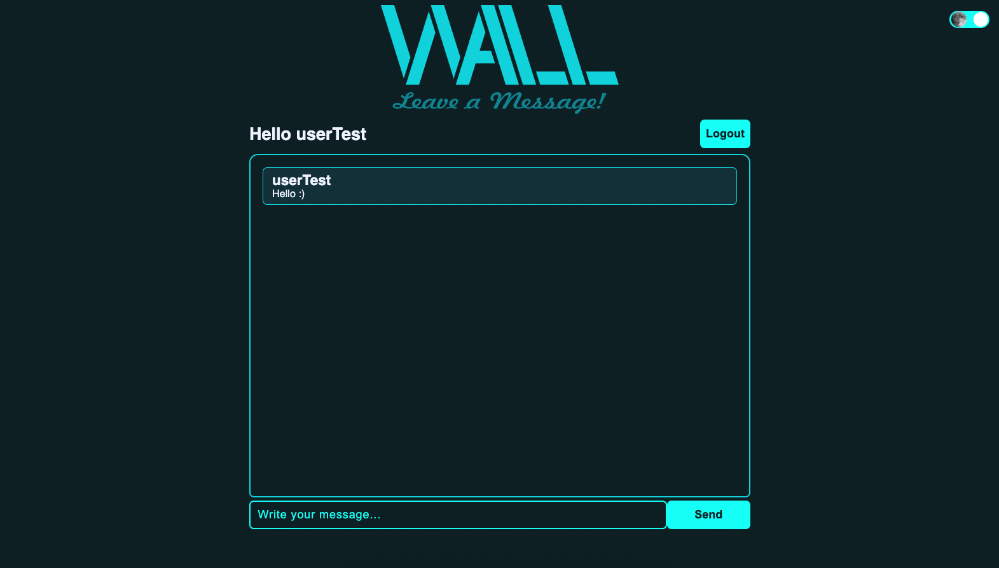

# WALL APP - FRONTEND

### Backend Link
- [Wall-Backend](https://github.com/mpessini/wall-backend)

## About



In this project, users can create a new account, sign in or enter as a visitor. Users can create a post on a wall if they are logged, or just read the posts, if they aren't.
This project was built using [React](https://reactjs.org/), [Typescript](https://www.typescriptlang.org/),  [Styled Components](https://styled-components.com/) and [Cypress](https://docs.cypress.io/)

## Installation

To run this application, open the terminal in any directory of your choice and run the commands below:

1. Clone the project
```bash
git clone git@github.com:mpessini/wall-frontend.git
```

2. Enter in project directory
```bash
cd wall-frontend
```

3. Install project dependencies
- If you have nvm installed, recommended run `nvm use` before install dependencies, to use the same node version of project, if you don't, recommended use node version 16.17.0(lts/gallium).
```bash
npm install
```
or
```bash
yarn install
```

4. Create your environment file using `.env.example` as an example

4. Start the project
```bash
npm start
```
or
```bash
yarn start
```

## Tests
This project uses cypress for testing. Cypress is an end2end testing tool.
- To run the project tests, make sure your application is running at `http://localhost:3000`. If you want change the application test url, to change the key `baseUrl` in `cypress.config.ts` to your application url.

- Tests are isolated from backend in this project, so you can run without backend connection.

Running tests on terminal:
```bash
npm run cy
```
or
```bash
yarn run cy
```

Running tests using Cypress UI:
```bash
npm run cy:open
```
or
```bash
yarn run cy:open
```

## Contacts
* [Marcelo Pessini](mailto:marceloppessini@gmail.com)
* [Linkedin](https://www.linkedin.com/in/marcelopessini/)

## Thank you TSL
- I really enjoy build this application.
